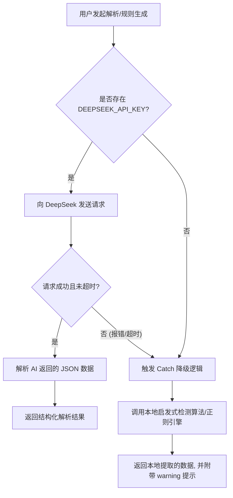

# 物流智能解析系统：大模型（DeepSeek）调用技术说明文档

本系统在处理非结构化及半结构化物流单据时，引入了 **DeepSeek 大模型**（`deepseek-chat`）用于**规则智能生成**与**非结构化文本嵌套提取**。为保障系统的鲁棒性与开发规范，系统设计了严密的 Prompt 约束、API 配置流与平滑降级（容灾）方案。

---

## 一、 大模型及配置方式

### 1. 默认模型选择
系统默认采用 **`deepseek-chat`** 模型（即 DeepSeek-V3 / DeepSeek-R1 接口适配）。该模型在保持极高性价比的同时，对于结构化输出（JSON) 的控制能力和复杂指令的遵循能力表现优异，非常适合用于物流字段提取和规则预测。

### 2. API Key 及网络配置
系统采用服务端环境变量统一管理敏感凭证，防止 API Key 泄露至前端。配置项统一存放于项目根目录的 `.env` 文件中：

- **`DEEPSEEK_API_KEY`**：大模型服务的 API 授权密钥（例如：`sk-5263a0e1766745abb0ce5e71adc0091e`）。
- **`DEEPSEEK_API_BASE`**（可选）：大模型服务的 API 基础请求地址，默认指向官方网关 `https://api.deepseek.com/v1`。系统对该路径进行了自动兼容处理，若用户填写的地址缺少 `/v1`，系统会自动补全，以确保适配 OpenAI 标准 SDK 格式。
- **`DEEPSEEK_MODEL`**（可选）：指定的调用模型名称，默认值为 `deepseek-chat`。

### 3. 请求控制与安全
- **接口防死锁与超时机制**：为了防止在云端函数（Vercel Serverless）等场景下由于网络波动导致无限挂起，接口调用加入了 `AbortController` 信号控制，最大超时时间强制限制为 **55秒**。
- **降级容灾设计**：当检测到未配置 `DEEPSEEK_API_KEY`，或者大模型调用失败/超时，系统不会崩溃，而是会**自动降级至本地算法引擎**（启发式算法或本地正则引擎），并向用户前端返回带警告（warning）的成功响应，确保业务不中断。

---

## 二、 场景一：智能解析规则生成 (Generate Rule)

### 1. 核心任务
当用户上传任意 Excel/PDF/Word 文件样本后，系统需要预测此文件的解析规则（如：表头在第几行、数据从哪行开始、有哪些标准字段对应的列名），输出符合 `RuleConfig` 结构定义的规则 JSON。

### 2. 样本切片优化（Token 缩减）
Excel 文件可能包含成千上万行数据。若全部送入大模型，不仅会消耗大量 Token，还会导致大模型注意力分散、响应速度变慢。
本系统在发送请求前对样本进行了**智能切片处理**：
- **保留前 15 行**：包含表头、多级合并单元格及顶部备注，以便大模型识别表头行（`headerRow`）和数据起始行（`dataStartRow`）。
- **保留后 10 行**：由于大量调拨单的收货信息、联系方式会存放在表格最底部（横向排列），保留后 10 行可以确保大模型精准抓取尾部关键字。
- **忽略中间行**：用占位符连接，将数据规模压缩到 30 行以内，提升了 80% 的响应速度。

### 3. Prompt 设计思路

#### System Prompt (系统级指令规约)
- **角色设定**：将 AI 设定为“物流系统的规则解析专家”，使其输出倾向于专业术语及紧凑的规则定义。
- **字段限制（硬约束）**：强制大模型**只允许识别考试限定的 10 个标准字段**，包括：
  - `externalCode` (外部编码/订单号)
  - `receiverStore` (收货门店/机构)
  - `receiverName` (收件人姓名)
  - `receiverPhone` (收件人电话)
  - `receiverAddress` (收件人地址)
  - `skuCode` (SKU物品编码)
  - `skuName` (SKU物品名称)
  - `quantity` (SKU发货数量)
  - `skuSpec` (SKU规格型号)
  - `remark` (备注)
- **特殊布局识别指示**：
  - **调拨单特殊模式**：明确告知大模型，如果表头中完全没有收件人或门店信息，必须要去样本的尾部行（`footerExtraction`）中扫描 `keyword-offset`（关键字-偏移量）规则。
  - **矩阵转置（MatrixPivot）**：提示大模型识别当门店名作为列头、SKU 在左侧时的矩阵报表。
  - **卡片式布局（CardLayout）**：指导识别以“▶”等特殊符号做分隔符的卡片块。
- **输出约束**：只返回标准的 JSON 数据，必须包裹在 ```json ... ``` 块中，严禁返回任何多余的解释。

#### User Prompt (用户级上下文)
传入文件名、文件类型以及切片后的样本数据。要求 mappings 中的 `column` 值必须与样本中实际的表头列名做到百分之百字面一致，防止映射偏差。

---

## 三、 场景二：非结构化文本嵌套提取 (Parse Text)

### 1. 核心任务
针对 PDF 或 Word 转换出来的纯文本内容，直接利用大模型的自然语言处理能力，提取为结构化的运单和商品数据。

### 2. 嵌套分组输出设计
非结构化文本往往在一页纸或一个文件内包含多个不同的收货门店及对应的不同商品明细。如果让 AI 直接扁平化输出，极易在“门店-商品”的对应关系上发生混乱。
为此，Prompt 采用了**嵌套分组结构设计**：
- 让大模型先将文本组织成以“订单（Order）”为单位的分组数组。
- 每个分组内包含 `orderInfo`（该单的收货门店、单号、联系人等）以及 `items` 数组（该单下的商品编码、品名、规格、数量列表）。
- 服务端接收到该嵌套 JSON 后，再通过扁平化（FlatMap）算法将其转化为扁平的 10 字段行结构，既保证了数据组织的准确度，又节约了大量的传输 Token。

### 3. Prompt 设计思路

#### System Prompt (提取与数据清洗策略)
- **角色设定**：将 AI 设定为“物流系统的高级数据提取专家”。
- **精细化数据清洗（重点针对考试测试文件）**：
  1. **物品名称与规格规格的剥离**：在实际业务（如服装或生鲜）中，纯文本中的商品行往往把商品名、规格、数量粘连在一起（如 `茶语柠听紫苏风味糖浆750ml*6瓶/件件2`）。
     - 策略：指示大模型精准剥离出纯商品名 `skuName`（`茶语柠听紫苏风味糖浆`）和规格型号 `skuSpec`（`750ml*6瓶/件`）。
  2. **过滤多余订货单位**：明确指出不能把无意义的尾部单位（如“件”、“包”、“瓶”）单独填入 `skuSpec` 中，确保规格字段的干净性。
  3. **数据类型强制转换**：限制最后的提取数量 `quantity` 必须是纯数字/正整数，以便后续进行数学运算或数据库校验。
- **输出约束**：只能返回包裹在 ```json ... ``` 块中的标准嵌套 JSON 数组。

---

## 四、 降级与容灾运行效果

当调用发生故障或无 API Key 时，系统的自动降级流程如下：



1. **规则生成降级**：
   - 系统使用启发式算法（`generateHeuristicRule`）分析表头。
   - 利用内置的 10 个标准字段别名库（例如 `receiverStore` 别名：`门店`、`收货门店`、`调入门店` 等）进行关键字匹配。
   - 自动扫描前几行和后几行，探测是否存在卡片标志（`▶`）、矩阵报表或底部联系人（`keyword-offset`）。
2. **文本提取降级**：
   - 降级至本地正则规则引擎（`RuleEngine.parseText`），根据生成好的正则表达式进行多行文本捕获，确保基础的文字提取功能依然能正常工作。
